# 스마트 모터 고장 예측 시스템

## 시스템 필요성

1. 안전사고 예방

   - 사람이 모터의 상태를 센싱하는 디바이스
     - 모터의 성능 상태를 실시간으로 모니터링
     - 시스템에서 고장 난 원인을 점검

2. 경제적 손실 예방

   - 공장의 가동이 중단될 때 발생되는 가동 중단 비용 (생산라인 중단, 고장 난 모터 교체 및 진단과 수리)

     - 산업현장의 핵심부품인 모터의 고장 예측, 점검 필요

     

## 아이디어 소개

모터의 고장을 진단해주고 모터의 수명을 예측해 사후 대응이 아닌 예방적 유지보수를 실시하여 불필요하고 생산성이 저하되는 현상을 방지하고 유지, 보수의 비용을 감소시키기 위한 시스템이다.

1. 사용하는 환경에서 동작하는 모터의 고장과 수명을 예측
2. 사용하는 환경에서 동작하는 모터의 고장의 원인을 진단, 실시간으로 모터의 동작 제어

## 작동 원리

1. 모터의 온도, 진동량, 변화되는 전압/전류를 측정하는 센서로부터 데이터를 수집
2. 수집된 데이터의 값을 공장 Gateway에 전송
3. 공장 Gateway에서 Server로 데이터 전공
4. Server는 공장 Gateway에서 받아온 데이터 값들을 이용하여 모터 수명 예측 알고리즘과 모터 고장 진단 알고리즘을 수행
5. 수행된 알고리즘의 값을 공장 내 모든 모터를 제어할 수 있는 WEB에 전송

## 시스템 흐름도

### 1. 라즈베리파이

### 2. 서버(local)

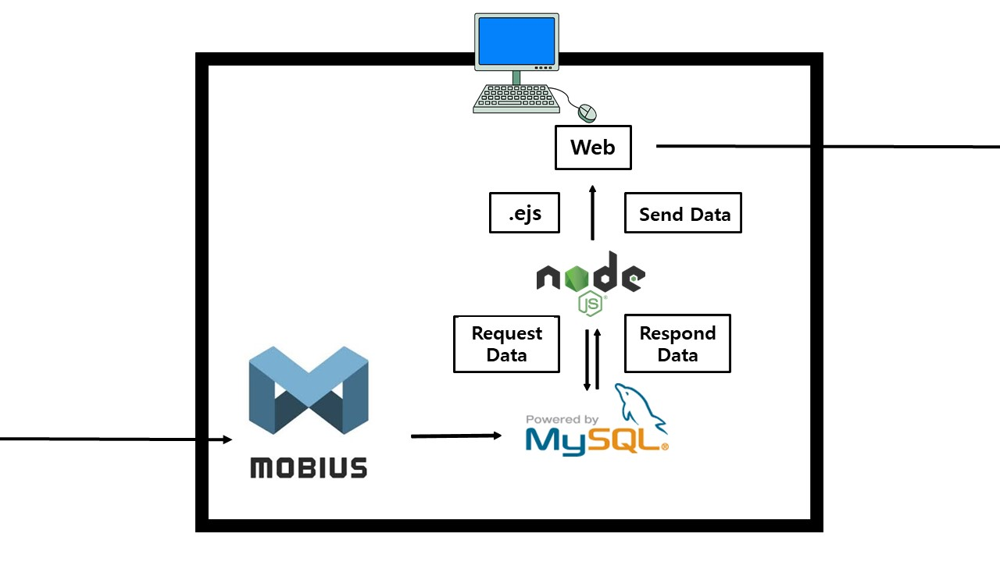

### 3. 웹 페이지

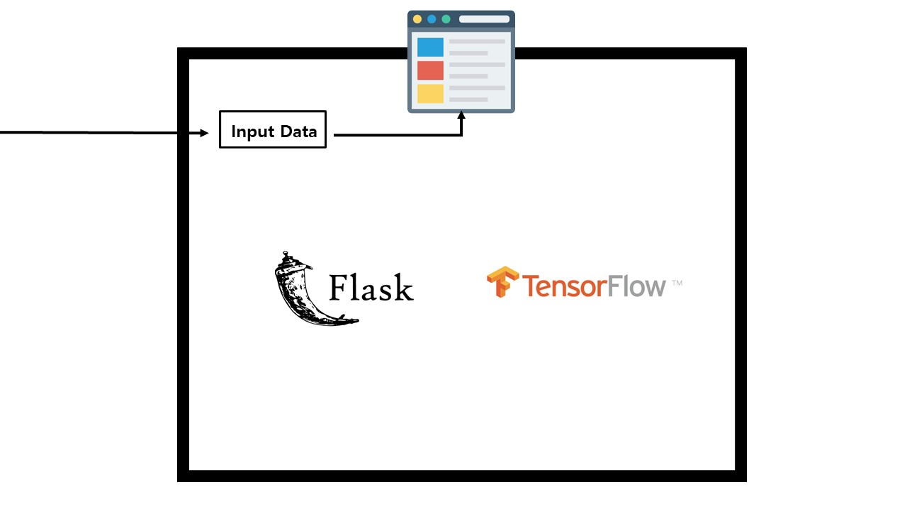

## 코드 설명

### 1. 아두이노에서 데이터 측정

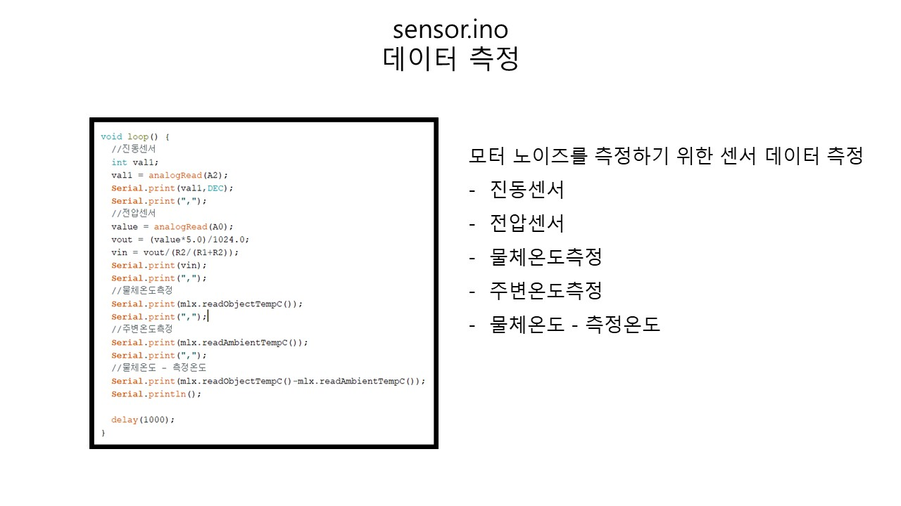

### 2. 아두이노에서 측정한 데이터 값 text파일 생성

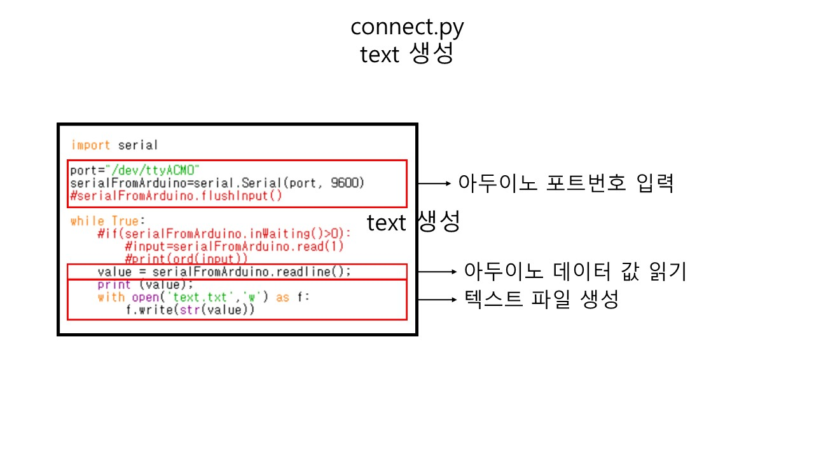

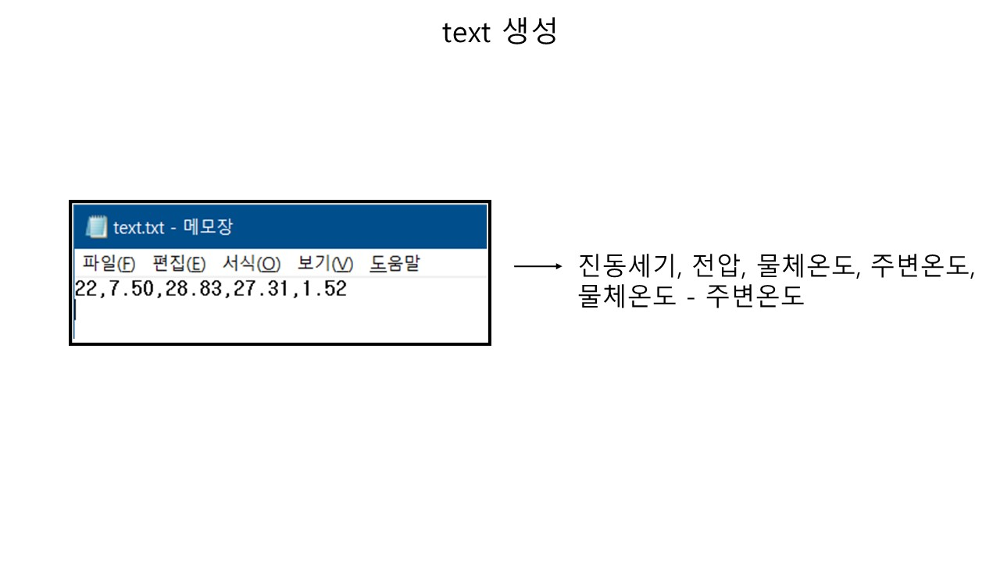

### 3. &Cube에서 텍스트 파일 읽은 후(app.js) Mobius 서버로 데이터 전송(thyme.js)

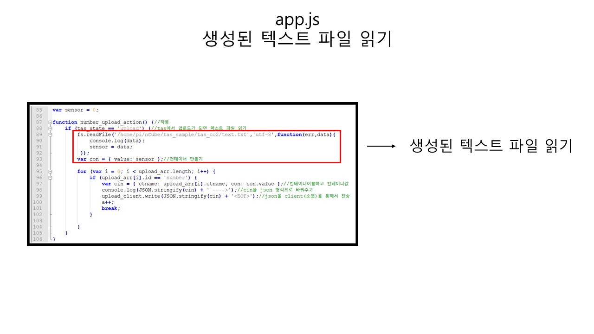

### 4. Mobius 서버에서 데이터 받은 후 MySQL에 저장한다.

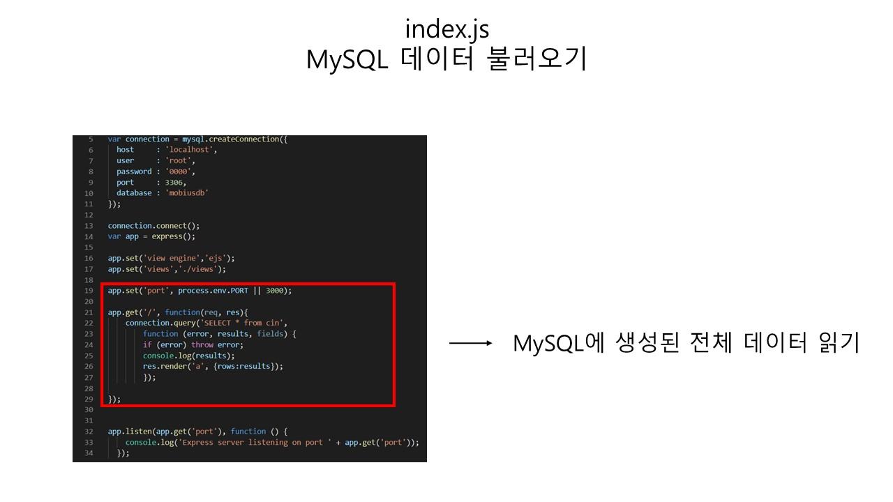

### 5. ejs에서 MySQL의 최신 값을 가지고 온다.

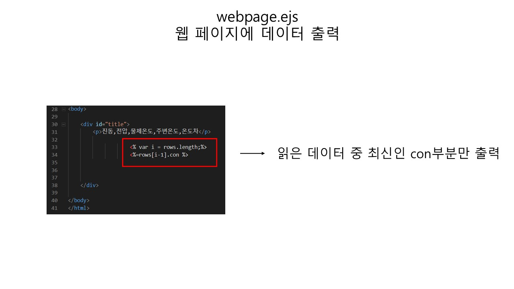

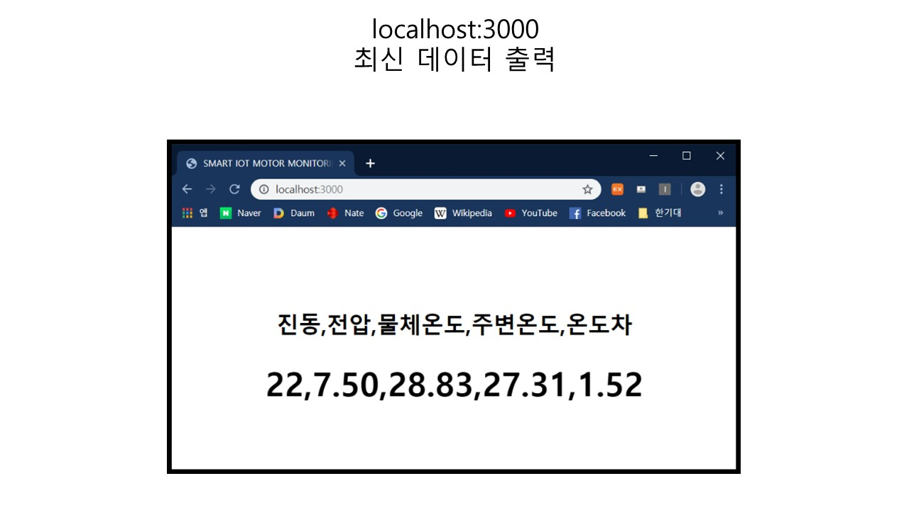

### 6. TAS(sensor) - &Cube:thyme - Mobius Server간의 연결

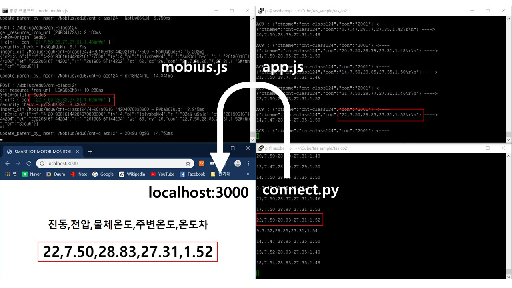

### 7. Flask

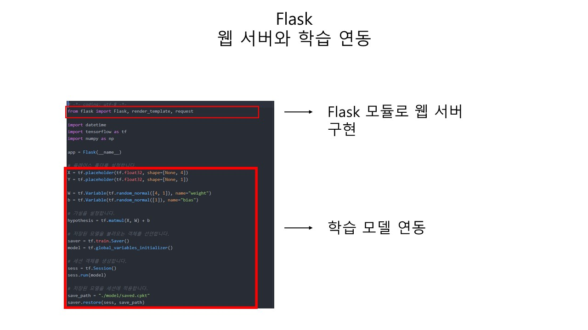

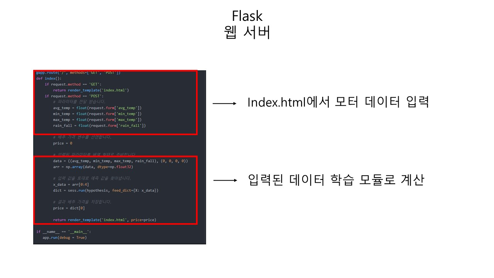

### 8. 최종 결과

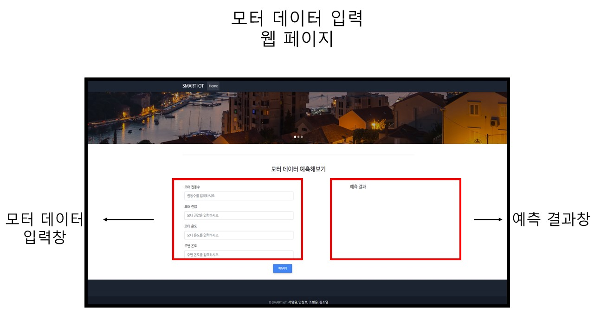

## 기술 소개

Mobius와 &Cube는 국내에서 개발한 oneM2M기반의 사물인터넷 플랫폼

### oneM2M이란?

> 응용 서비스 인프라(플랫폼) 환경을 통합하고 공유하기 위한 사물 인터넷 공동 서비스 플랫폼 개발을 위해 발족된 표준화 단체이다.

### Mobius

> 사물 간에 인터넷을 할 수 있는 물적 기반인 통신 네트워크가 원활하게 작동하도록 하는 운영체제

디바이스 플랫폼

- 다른 플랫폼들과의 연동을 지원
- 사물인터넷 디바이스 개발사가 쉽게 서비스를 개발할 수 있도록 한다.
- 개방형 API를 지원해 디바이스의 정보를 웹 기반으로 획득하거나 제어가 가능하도록 한다.
- 사물인터넷 디바이스의 프로파일 및 센싱데이터, 보안 및 제어 등과 관련된 사물인터넷 디바이스를 위한 소프트웨어 기반의 공통 데이터 구조를 제공한다.
- 하드웨어 통신 모듈을 통해서 지그비 통신과 3G/4G 기반 이동통신 또는 와이파이/이더넷 기반 IP 통신을 변환하는 통신 어댑터의 기능을 제공한다.

엔큐브(&Cube)

> 모비우스 플랫폼에서 디바이스 플랫폼의 이름이다. 사물인터넷 디바이스, 게이트웨이에 탑재되는 소프트웨어 플랫폼이다.