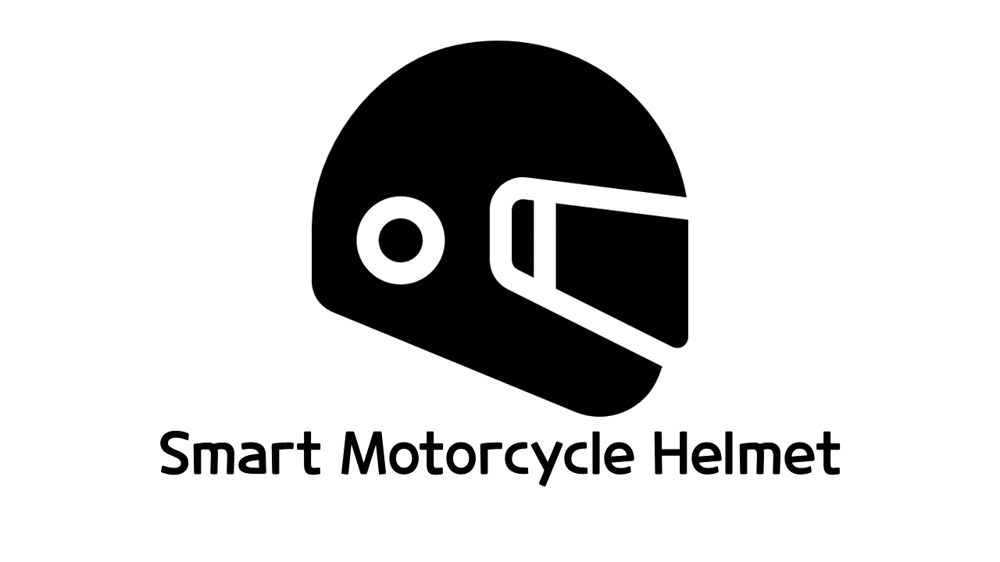
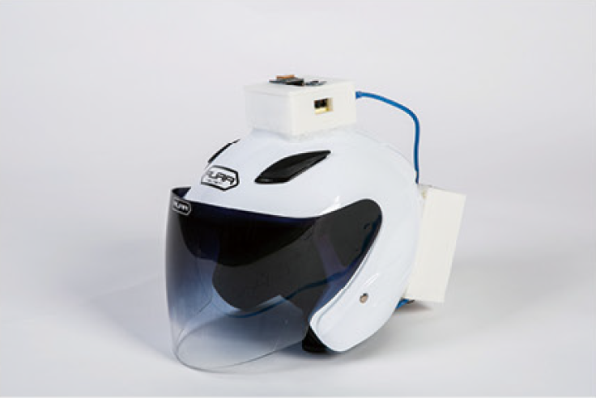

UCC 주소: https://youtu.be/bBkeLyy_fOs

성과: 학부 내 상위팀으로 선정되어 학교 전체 16팀이 참가하는 졸업작품 경진대회 참가. 장려상

## 프로젝트 시연

### 1. 긴급연락망 추가

> 안드로이드 애플리케이션에서 Restful 방식으로 긴급연락망을 추가한다.

### 2. 네비게이션 안내

> 카카오 네비 API를 활용하여 위도/경도를 입력하면 해당 목적지까지 안내를 해준다. 
>
> 헬멧에 라즈베리파이를 결합하여 핸드폰과 블루투스 연결이 가능하다.
>
> 라즈베리파이 스피커를 통해 사용자는 외부 소리와 단절되지 않은 채 핸드폰 소리를 들을 수 있다.

### 3. 사고 발생 시 위치 확인

> 라즈베리파이에 장착한 가속도 센서를 통해 사고 발생 유무를 판별하고 사고 발생 시, 등록한 긴급연락망으로 문자 메시지가 전송된다.
>
> GPS 센서를 통해 사고 발생 지점을 받아 좌표값을 서버로 넘겨준다.
>
> 문자 메시지는 웹 페이지 주소가 넘어가고 웹 페이지에서는 사고 발생 지점과 사용자의 긴급연락망을 보여준다.

### 4. 외형

