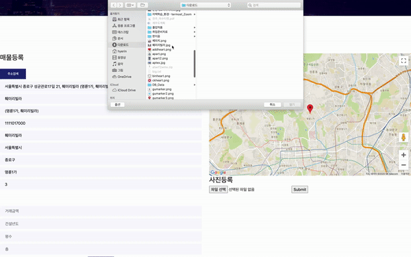
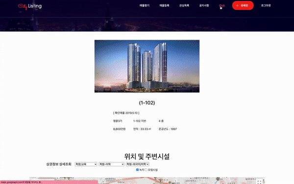
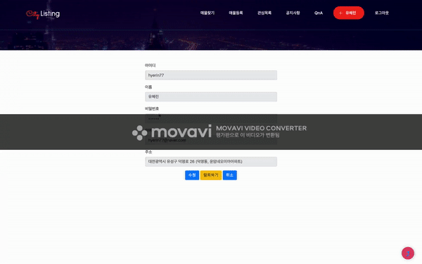
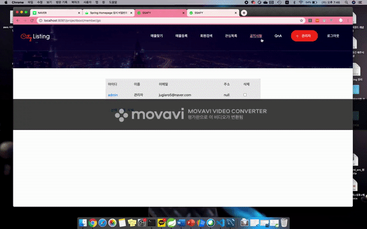
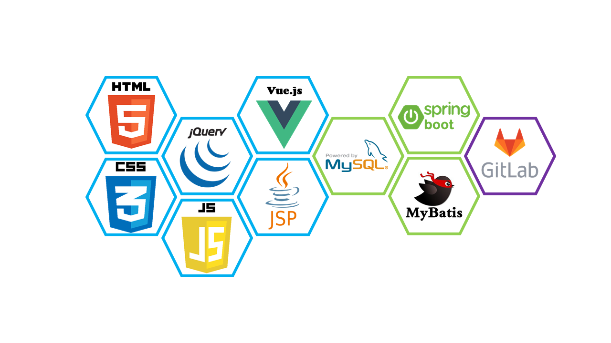

UCC 주소: https://youtu.be/KJ1Mx305sRU

## 프로젝트 시연

### 1. 로그인

> Restful API를 구축하여 axios요청을 보내고 

> 네이버 SMTP를 활용해 이메일 인증 절차를 밟는다.

### 2. 매물등록

> 한국지역정보개발원(https://www.juso.go.kr/addrlink/main.do?cPath=99MM)의 주소 검색 API를 활용하여 주소 입력을 간편하게 하였다.

> 동시에 이미지를 등록할 수 있도록 구현하였다.

### 3. 매물찾기

> 사용자가 원하는 지역을 검색하여 매물을 볼 수 있고 마커 클러스터링을 활용하여 보기 쉽게 표현을 하였다. 지도는 Google Map API를 활용하였다.

### 4. 매물 상세보기

> 공공데이터포탈(https://www.data.go.kr/)의 데이터를 활용하여 주변 녹지, 상권 정보 등을 제시하여 매물의 주변 환경을 알 수 있도록 구현하였다.

### 5. QnA

> QnA 부분만 Vue.js를 활용하여 구현하였다.

### 6. 마이페이지

> 내 정보를 쉽게 수정/탈퇴 할 수 있는 기능을 구현하였다.

### 7. 비밀번호 찾기

> 네이버 SMTP를 활용하여 사용자 메일로 임시 비밀번호를 발급해준다.

### 8. 관리자 페이지

> 관리자는 회원정보, 공지사항에 대한 권한을 가질 수 있다.

## 기술 스택

