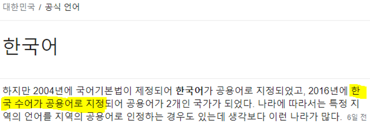
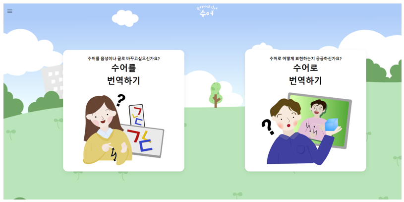
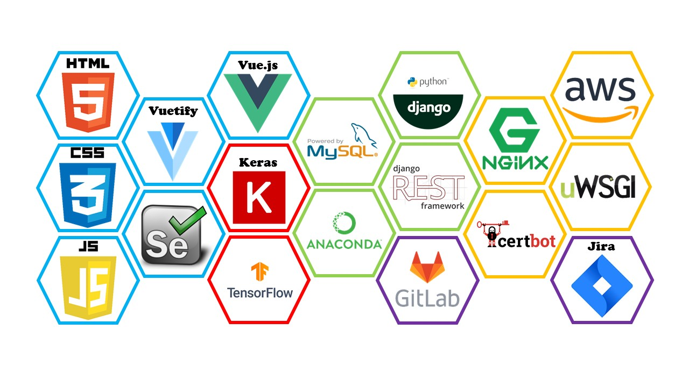
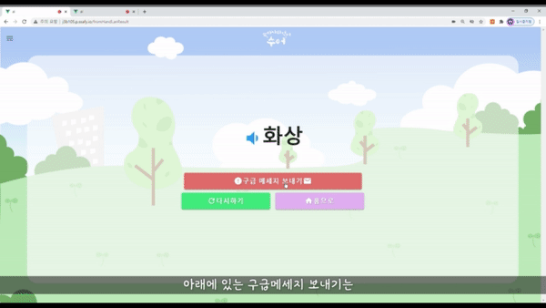
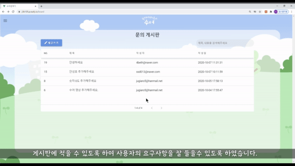

UCC 주소: https://youtu.be/p6Ccgq0pd8o

성과: UCC 전국 1등, 대전 1반 2등

## 0. 주제

1. **수어를 번역** (딥러닝)
2. **수어로 번역** (크롤링)

기능을 제공하는 **양방향 수어 번역 웹 서비스**를 제공하는 웹 어플리케이션이다.

## 1. 프로젝트 소개

### 1-1. 주제 선정 배경

> 한국수화언어(수어)는 한국수화언어법으로 국어와 동등한 지위이고 한국 수어는 2016년 공용어로 지정되었다. 따라서 수어 사용에 따른 소통의 어려움이 없어야한다.
>
> 하지만, 한국 수어를 사용하는 농인, 청인과 한국어를 사용하는 사람간의 소통을 위해서는 수어를 배워야하는 어려움이 존재했다. 이러한 소통의 문제를 개선하기 위해서 한국어를 사용하는 일반인이 수어의 의미를 이해할 수 있고, 농인은 일상 생활에서의 사물, 단어 등을 국어로 이해할 수 있도록 **딥러닝**을 이용한 **양방향 수어 번역 시스템**을 개발하게 되었다.

### 1-2. 시장분석

> 현재 국립국어원의 한국수어사전 페이지이다. 이는 농인들이 검색하기에 다소 불편함이 존재했다.

### 1-3. 특장점 및 기대효과

> 서비스를 간편하게 이용할 수 있도록 기능을 제공한다. 

### 1-4. 주요대상 및 타겟

- 자신의 수어에 대한 의미를 전달하기 위한 사람들
- 수어를 배우고 싶어하는 사람들

## 2. 시스템 아키텍처

### 2-1. 기술 스택

### 2-2. 서비스 흐름도

- 주요 기능

  - 수어 -> 글

    1. 수어 영상을 찍기(데이터 셋 한정) >> 번역 + 스피커(읽어주기) + 신고

  - 글 -> 수어

  1. 글씨를 수어로 변환

     1-1. 글씨 작성 >> 수어

     1-2. 사진(글씨 + 물체) 찍기 >> 수어

       

- 세부 기능

  - 웹에서 글씨 위로 마우스 올리면 글씨에 대한 수어 보여주기
  - 회원관리
  - 건의 게시판
  - 수어 자신이 만들어서 올리기

## 3. 프로젝트 시연

### 3-1. 수어를 번역

> Ai hub(https://www.aihub.or.kr/)의 수어 데이터를 학습시켜 촬영한 영상이 무슨 수어인지 찾아낸다.

### 3-2. 번역 후 TTS 및 문자 메시지 보내기

> 음성 버튼을 누르면 TTS로 해당 단어가 읽어지고 문자 메시지를 보내어 긴급한 상황을 알릴 수 있다.

### 3-3. 수어로 번역하기 - 수어 사전

> 수어를 검색하면 국립국어원 한국수어사전(http://sldict.korean.go.kr/front/main/main.do)의 데이터를 크롤링하여 검색한 단어를 보여준다.

### 3-4. 단어장 추가

> 검색한 단어를 내 단어장에 추가할 수 있다.(단, 로그인 할 시, 참고적으로 로그인은 카카오 로그인으로 구현)

### 3-5. 수어로 번역하기 - 수어찾기

> 사진을 촬영하면 text/object detection을 통해 해당 단어를 크롤링한 데이터로 보여준다.

### 3-6. 문의 게시판

> 문의 게시판에 동영상을 업로드 할 수 있어 장애인들도 영상으로 문의를 할 수 있는 게시판을 만들었다.

