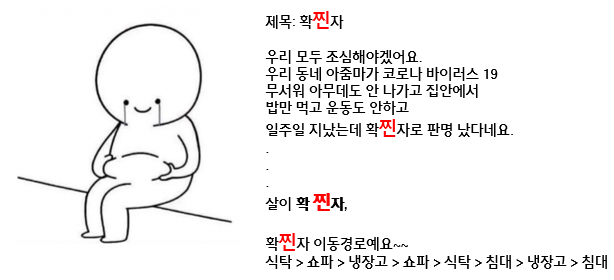
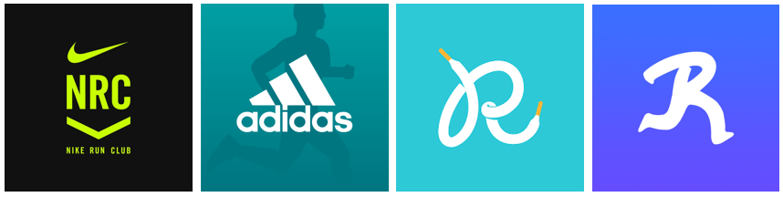
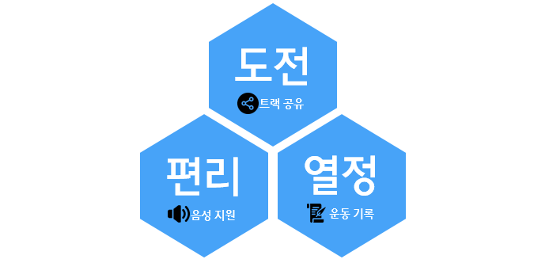
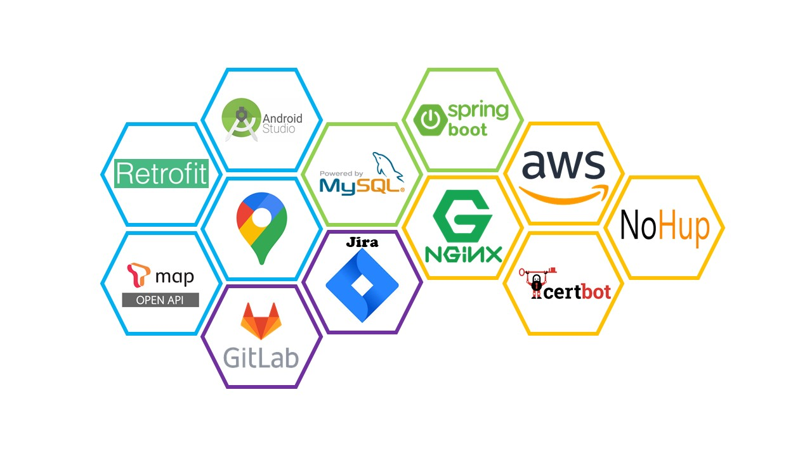
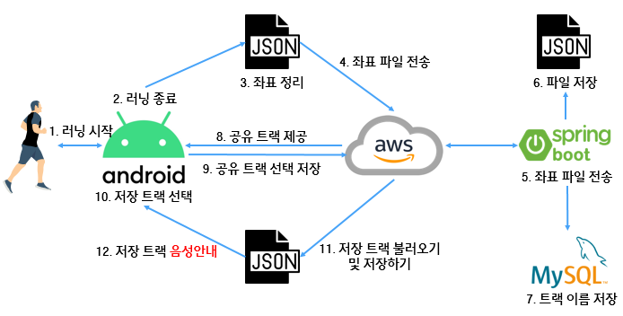
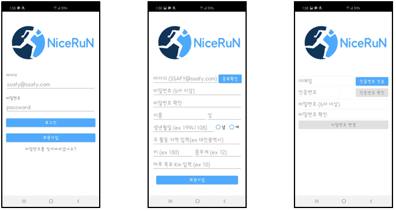
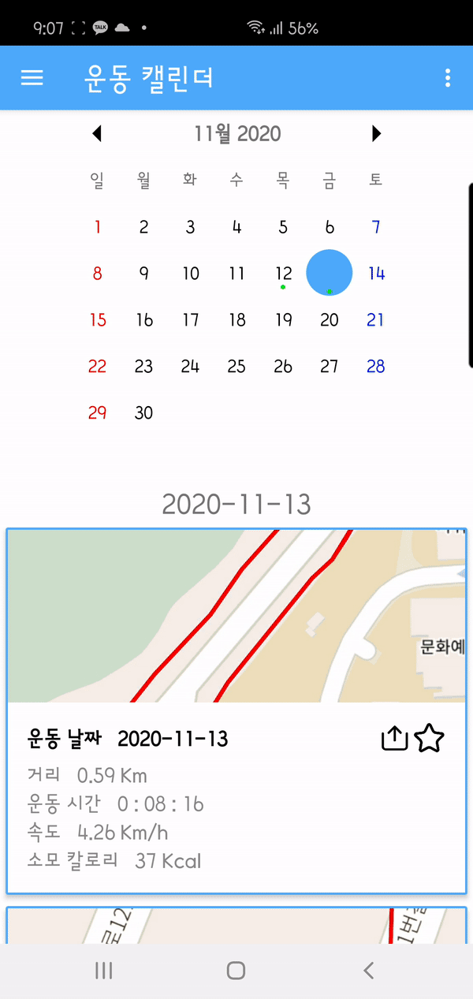
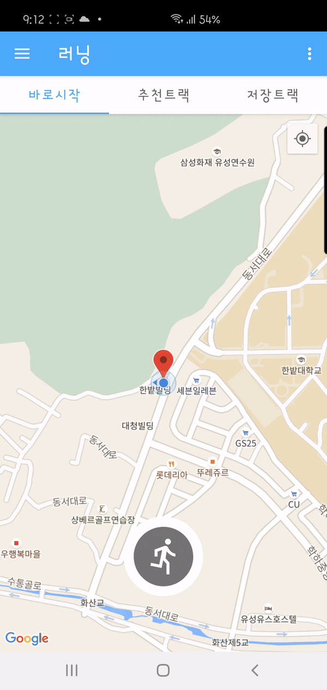

UCC 주소: https://youtu.be/-2_TJjFjgzM

성과: 대전 2반 2등

## 0. 주제

나만의 러닝 트랙을 공유하여 즐거운 **러닝 어플리케이션**을 제공한다. 이때, 공유된 러닝 트랙은 자체 제작 **음성 네비게이션**을 통해 길 안내를 해주어 사용자에게 편의성을 제공한다.

## 1. 프로젝트 소개

### 1-1. 주제 선정 배경

> 코로나 19 사태로 인해 대부분 사람들은 외부 활동을 자제하고 집에서 주로 생활하고 있어 칼로리를 소비할 활동이 점점 줄어들은 상황이다. 
>
> 코로나 초기에는 헬스장의 출입을 금지시켰고, 최근에는 헬스장에서 마스크를 쓰면서 운동을 해야하는 불편함이 늘어나고 있다. 이에 야외 운동을 하는 사용자들이 증가하고 더불어, 러닝 어플리케이션의 사용량이 증가하고 있다.

### 1-2. 시장분석

> 현재 스포츠 브랜드에서는
>
> 1. 나의 트랙 정보 기록
> 2. "km단위로 시속 ~km/h, 평균 속도입니다."의 간단한 음성 정보만 제공
> 3. 러닝 이벤트(마라통 등) 정보 제공
>
> 의 기능을 가지고 있었다.

### 1-3. 특장점 및 기대효과

NiceRuN 어플리케이션은 기존 서비스에서 기능을 **추가**적으로 제공한다.

>매일 같은 트랙만 뛰는 사용자들의 흥미를 일으켜주기 위해 사용자들 간에 **트랙을 공유**하는 서비스를 제공한다. 하지만 공유받은 트랙을 사용할 때, 핸드폰을 보면서 뛰는 불편함이 존재하는데, 이를 해결하기 위해 **음성 네비게이션** 서비스를 제공하여 핸드폰을 볼 필요없는 편안함을 제공한다.
>
>더불어, 운동 기록을 보기 쉽게 제공하여 사용자의 운동에 대한 열정을 불러 일으켜준다.

### 1-4. 주요대상

- 매일 같은 트랙만 걸어 운동에 대한 흥미를 잃어버린 사람들
- 야외 운동의 즐거움을 가진 사람들

## 2. 시스템 아키텍처

### 2-1. 기술 스택

### 2-2. 서비스 흐름도

## 3. 프로젝트 시연

### 3-1. 로그인

> 간단한 회원 정보를 입력한다. 추후에 kcal 계산을 위해 개인 정보도 입력 받는다. 또, 비밀번호 찾기 기능을 제공하는데 네이버 SMTP 서비스를 이용하여 이메일 인증을 통해 이루어진다.

### 3-2. 메인 페이지 - 바로 시작 탭

> 바로 시작 탭에서는 **자신의 러닝 트랙을 개척**할 수 있는 서비스를 제공한다. 러닝을 시작하면 시작 지점부터 위치를 추적하기 시작한다. 그리고 중간 중간 자신이 뛰어온 길을 볼 수 있다.
>
> 지도는 Google Map API를 사용하였다.

시연영상1: https://youtu.be/AVBxILM_zCA

### 3-3. 운동 캘린더

> 자신의 운동 기록을 날짜 별로 한 눈에 볼 수 있는 페이지이다. 이 페이지에서는 자신의 트랙을 공유할 수 있고, 자신의 저장 페이지에 저장할 수 있다. 자신의 저장 페이지에 저장을 하면 추후 음성 네비게이션 서비스를 제공해준다.

### 3-4.  메인 페이지 - 공유 트랙

### 3-5.  메인 페이지 - 저장 트랙 - 음성 네비게이션

> 저장한 트랙을 모두 볼 수 있는 페이지다. 이는 사용자의 접근성을 높이기 위해 제공하는 서비스이다. 저장 트랙의 시작버튼을 누르면 **음성 네비게이션** 서비스를 제공하여 사용자의 불편함을 해소시켜준다.
>
> 사용자가 출발 지점보다 떨어진 지점에 위치하면 이 또한, 출발 지점까지 음성 네비게이션 서비스를 제공한다.

시연영상2: https://youtu.be/V085KRQ3hiw

### 3-6. 마이페이지

> 자신의 개인정보를 수정할 수 있고 동시에 이미지를 업로드 할 수 있다. 이미지는 카메라 촬영 또는 앨범 사진을 선택할 수 있다.

### 3-7. 레벨 페이지

> 자신의 총 이동거리를 계산하여 레벨을 표시해준다.

