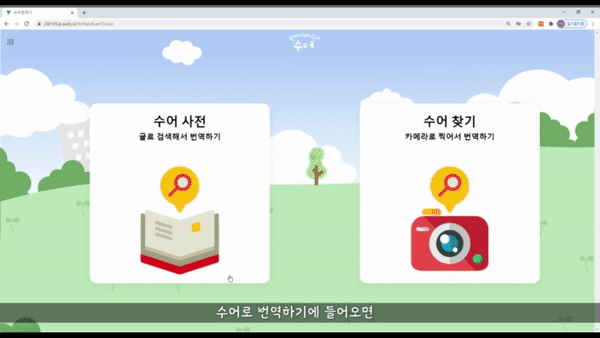
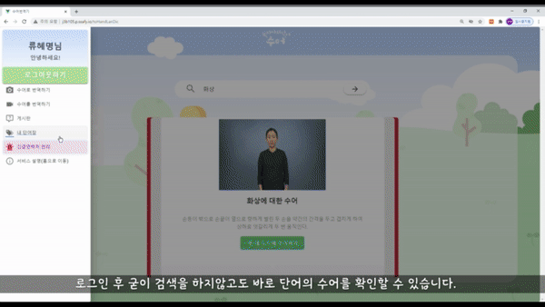

UCC 주소: https://youtu.be/p6Ccgq0pd8o

성과: UCC 전국 1등, 대전 2등

## 1. 프로젝트 소개

### 1-1. 주제

- 수어를 번역하기
- 수어로 번역하기

### 1-2. 문제인식

- 청각장애인
  - 수어를 모르는 사람과 소통하기가 불편하다.
  - 청각장애인의 30%는 농인으로 글씨조차 읽을 수 없는 불편함이 있다.

### 1-3. 기획의도

### 1-4. 주요대상 및 타겟

## 2. 주요기능

- 주요 기능

  - 수어 -> 글

    1. 수어 영상을 찍기(데이터 셋 한정) >> 번역 + 스피커(읽어주기) + 신고

  - 글 -> 수어

  1. 글씨를 수어로 변환

     1-1. 글씨 작성 >> 수어

     1-2. 사진(글씨 + 물체) 찍기 >> 수어

       

    2. (보류) 음성을 수어로 변환(음성 -> 글 -> 수어)

- 세부 기능

  - 웹에서 글씨 위로 마우스 올리면 글씨에 대한 수어 보여주기
  - 회원관리
  - 건의 게시판
  - 수어 자신이 만들어서 올리기

## 3. 프로젝트 시연

### 3-1. 수어를 번역

> Ai hub(https://www.aihub.or.kr/)의 수어 데이터를 학습시켜 촬영한 영상이 무슨 수어인지 찾아낸다.

### 3-2. 번역 후 TTS 및 문자 메시지 보내기

> 음성 버튼을 누르면 TTS로 해당 단어가 읽어지고 문자 메시지를 보내어 긴급한 상황을 알릴 수 있다.

### 3-3. 수어로 번역하기 - 수어 사전

> 수어를 검색하면 국립국어원 한국수어사전(http://sldict.korean.go.kr/front/main/main.do)의 데이터를 크롤링하여 검색한 단어를 보여준다.

### 3-4. 단어장 추가

> 검색한 단어를 내 단어장에 추가할 수 있다.(단, 로그인 할 시, 참고적으로 로그인은 카카오 로그인으로 구현)

### 3-5. 수어로 번역하기 - 수어찾기

> 사진을 촬영하면 text/object detection을 통해 해당 단어를 크롤링한 데이터로 보여준다.

### 3-6. 문의 게시판

> 문의 게시판에 동영상을 업로드 할 수 있어 장애인들도 영상으로 문의를 할 수 있는 게시판을 만들었다.

