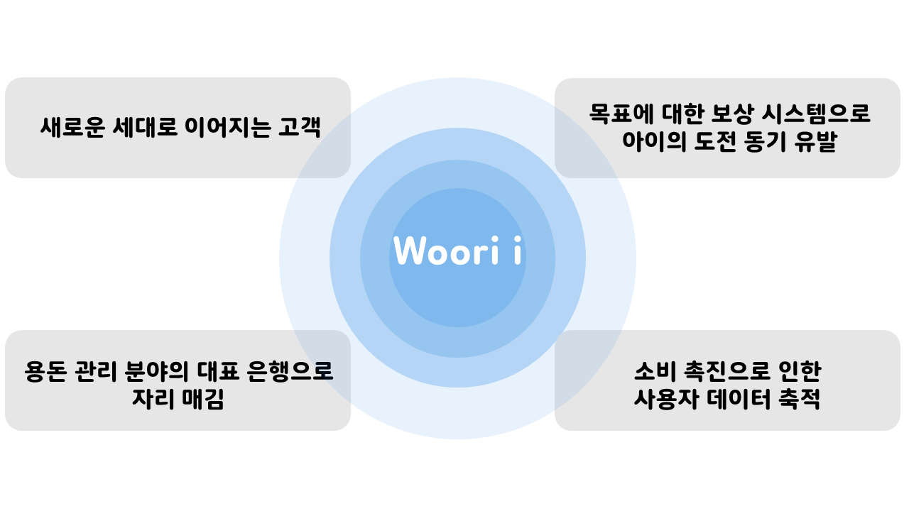
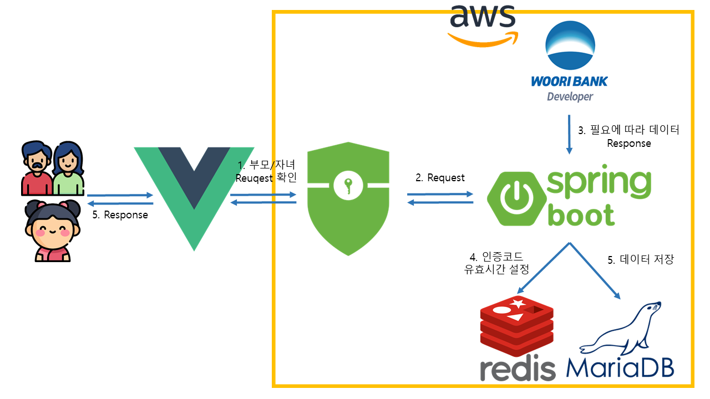
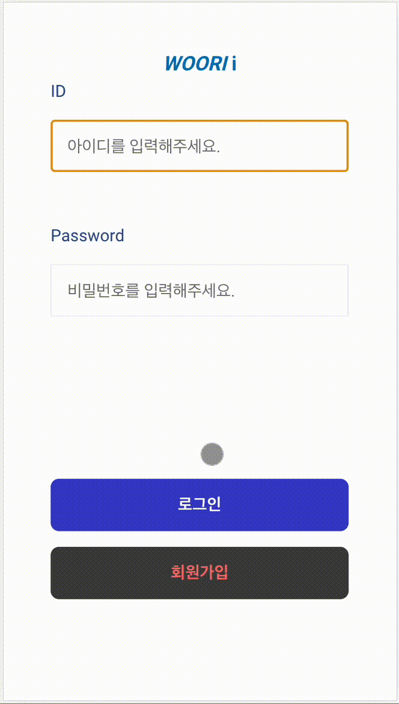
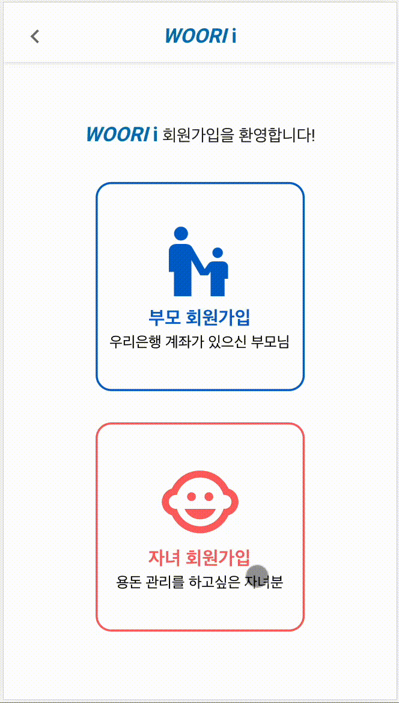
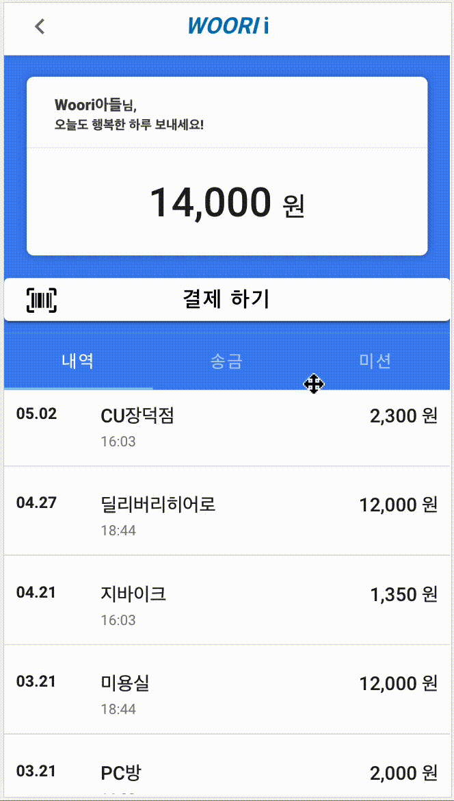

<center>
	<p align="center"></p>
</center>


<br/>


### 성과: 우리은행 온택트 해커톤 대상

### UCC: https://youtu.be/YFNKrRlOvww

<br/>

## 0. 주제: 투명하고 간편한 우리 아이 용돈 관리 서비스

부모와 자녀의 **간편한 계좌 연동**을 바탕으로, 부모는 자녀의 **소비 현황**을 쉽게 파악할 수 있고, 자녀는 **금전적 보상**을 통해 경제 관념을 확립할 수 있다.

<br/>

자녀는 부모의 계좌와 연동하여 부모가 설정한 한도 내의 금액을 사용할 수 있다. 이때 금전적 보상을 받은 경우, 한도를 일회적으로 늘릴 수 있다.

<br/>

<br/>

## 1. 프로젝트 소개

### 1-1. 주제 선정 배경

- 우리은행 "우리 아이(Eye)" 서비스 출시, 금융권 최초 **비대면 자녀 계좌 조회** 서비스
- 금융위원회는 올해 6월부터 만 12세 이상 **청소년**도 부모 동의 하 본인 명의 **신용카드** 발급받는 규제를 2년간 한시적으로 완화. 단, 부모가 한도 설정

<br/>

### 1-2. 특장점 및 기대효과

<center>
	<p align="center"></p>
</center>
<br/>

### 1-3. 주요 대상

- 부모: 자녀의 소비 현황을 쉽게 파악할 수 있다.
- 자녀: 금전적 보상을 통해 경제 관념을 확립할 수 있다.

<br/><br/>

## 2. 시스템 아키텍처

### 2-1. 기술 스택

<center>
	<p align="center"></p>
</center>

### 2-2. 서비스 흐름도

<center>
	<p align="center"></p>
</center>
<br/><br/>

## 3. 프로젝트 시연

### 3-1. 부모: 회원가입

> 휴대폰 인증 절차를 거친다. 이때, 인증번호는 Redis DB를 활용해 유효시간을 설정해 안정성을 향상시켰다.

<center>
	<p align="center"></p>
</center>
<br/>

### 3-2. 자녀: 회원가입

> 자녀는 부모의 QR코드를 인식하여 회원가입 완료 시, 자동으로 부모 계좌와 연동된다.

<center>
	<p align="center"></p>
</center>
<br/>

### 3-3. 자녀: 송금

> 자녀는 제한된 한도 내의 금액을 송금할 수 있다.

<center>
	<p align="center"></p>
</center>
<br/>

### 3-4. 자녀: 미션 확인 및 등록

> 자녀가 미션을 등록할 시, 부모에게 미션 등록 확인을 받아야 최종적으로 미션이 등록된다.

<center>
	<p align="center"></p>
</center>
<br/>

### 3-5. 부모: 자녀 거래내역 확인 및 의심 거래 설정

> 부모는 자녀의 거래 내역을 확인할 수 있고 거래 의심 지역과 시간을 설정해 알림을 받을 수 있다.

<center>
	<p align="center"></p>
</center>
<br/><br/><br/><br/>

## Spring Boot API Server 빌드 가이드(Ubuntu 기준)

```
0. sudo apt-get install openjdk-11-jdk openjdk-11-jre build-essential nasm autotools-dev autoconf libjemalloc-dev tcl tcl-dev uuid-dev libcurl4-openssl-dev nginx

1. 
sudo echo -e "export JAVA_HOME=/usr/lib/jvm/java-11-openjdk-amd64 \n" >> /etc/profile
sudo echo -e "export PATH=$JAVA_HOME/bin/:$PATH \n" >> /etc/profile
sudo echo -e "export CLASS_PATH=$JAVA_HOME/lib:$CLASS_PATH \n" >> /etc/profile

2. source /etc/profile

3. sudo reboot now

4. cd ~

5. git clone https://github.com/EQ-Alpha/KeyDB.git

6. cd KeyDB

7. make

8. sudo make install

9. cd ~

10. git clone https://github.com/JudyH0pps/Woofy (혹은 이 문서의 소스코드 폴더로 이동)

11. cd ./Woofy/backend

12. ./backend/woofy/src/main/java/com/hackathon/woofy/config/Keys.java 생성 및 하단의 별첨 내용 작성 (제출 코드에는 기본 첨부)

13. ./backend/woofy/src/main/resources/application-db.properties 생성 및 하단의 별첨 내용 작성 (제출 시 기본 첨부)

14. sudo service nginx start

15. ./gradlew clean build 혹은 ./gradlew clean build -x test

16. nohup java -jar ./build/libs/woofy-0.0.1-SNAPSHOT.jar &
```


## Frontend 빌드 가이드
```
1. sudo apt-get install npm

2. cd ~

3. git clone https://github.com/JudyH0pps/Woofy (혹은 이 문서의 소스코드 폴더로 이동)

4. cd ./Woofy/frontend

5. npm install

6. (개발 서버 구동 시) npm run serve

7. (빌드) npm run build
```


## Keys.java

```java
package com.hackathon.woofy.config;

import lombok.Getter;

@Getter
public class Keys {
        private final String wooriAppKey= "(SECRET KEY)";
        private final String wooriSecretkey = "(SECRET KEY)";

        private final String smsAppKey = "(SECRET KEY)";
        private final String smsSecretKey = "(SECRET KEY)";

        private final String smsSenderNumber = "(DEBUG PHONE NUMBER)";
        private final String smsDebugReceiver = "(DEBUG PHONE NUMBER)";
}


## application-db.properties

​```properties
spring.datasource.driver-class-name=org.mariadb.jdbc.Driver
spring.datasource.url=jdbc:{db_url}/woofydb?serverTimezone=UTC&useUnicode=yes&characterEncoding=UTF-8
spring.datasource.username=(secret username)
spring.datasource.password=(secret password)

spring.redis.host=localhost
spring.redis.port=6379


## /etc/nginx/site-enabled/default

​```default
upstream backend {
        server localhost:8080;
}


server {
        listen 80 default_server;
        listen [::]:80 default_server;

        # SSL configuration
        #
        # listen 443 ssl default_server;
        # listen [::]:443 ssl default_server;

		root /var/www/html;

        # Add index.php to the list if you are using PHP
        index index.html index.htm index.nginx-debian.html;

        server_name _;

        location / {
                try_files $uri $uri/ =404;
        }

        location /api {
                proxy_pass http://localhost:8080;
                proxy_http_version 1.1;
                proxy_set_header Connection "";

                proxy_set_header Host $host;
                proxy_set_header X-Real-IP $remote_addr;
                proxy_set_header X-Forwarded-For $proxy_add_x_forwarded_for;
                proxy_set_header X-Forwarded-Proto $scheme;
                proxy_set_header X-Forwarded-Host $host;
                proxy_set_header X-Forwarded-Port $server_port;
        }
}
```

