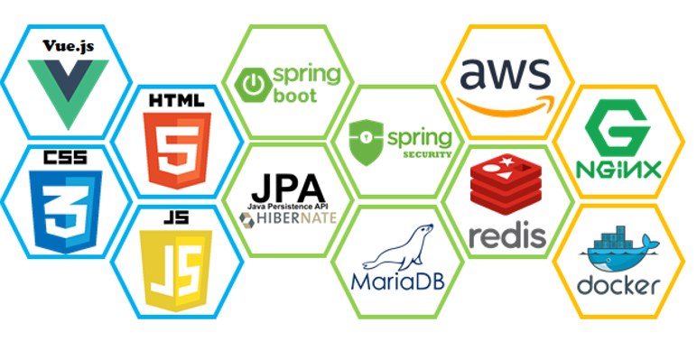

# Woori i




## 기술 스택

```
- Vue.js
- HTML5
- CSS3
- JavaScript
- Spring boot
- Spring Security
- Maria DB
- JPA Hibernate
- AWS EC2, RDB
- KeyDB (≒ redis)
- Nginx
```


## Spring Boot API Server 빌드 가이드(Ubuntu 기준)

```
0. sudo apt-get install openjdk-11-jdk openjdk-11-jre build-essential nasm autotools-dev autoconf libjemalloc-dev tcl tcl-dev uuid-dev libcurl4-openssl-dev nginx

1. 
sudo echo -e "export JAVA_HOME=/usr/lib/jvm/java-11-openjdk-amd64 \n" >> /etc/profile
sudo echo -e "export PATH=$JAVA_HOME/bin/:$PATH \n" >> /etc/profile
sudo echo -e "export CLASS_PATH=$JAVA_HOME/lib:$CLASS_PATH \n" >> /etc/profile

2. source /etc/profile

3. sudo reboot now

4. cd ~

5. git clone https://github.com/EQ-Alpha/KeyDB.git

6. cd KeyDB

7. make

8. sudo make install

9. cd ~

10. git clone https://github.com/JudyH0pps/Woofy (혹은 이 문서의 소스코드 폴더로 이동)

11. cd ./Woofy/backend

12. ./backend/woofy/src/main/java/com/hackathon/woofy/config/Keys.java 생성 및 하단의 별첨 내용 작성 (제출 코드에는 기본 첨부)

13. ./backend/woofy/src/main/resources/application-db.properties 생성 및 하단의 별첨 내용 작성 (제출 시 기본 첨부)

14. sudo service nginx start

15. ./gradlew clean build 혹은 ./gradlew clean build -x test

16. nohup java -jar ./build/libs/woofy-0.0.1-SNAPSHOT.jar &
```


## Frontend 빌드 가이드
```
1. sudo apt-get install npm

2. cd ~

3. git clone https://github.com/JudyH0pps/Woofy (혹은 이 문서의 소스코드 폴더로 이동)

4. cd ./Woofy/frontend

5. npm install

6. (개발 서버 구동 시) npm run serve

7. (빌드) npm run build
```


## Keys.java

```java
package com.hackathon.woofy.config;

import lombok.Getter;

@Getter
public class Keys {
        private final String wooriAppKey= "(SECRET KEY)";
        private final String wooriSecretkey = "(SECRET KEY)";

        private final String smsAppKey = "(SECRET KEY)";
        private final String smsSecretKey = "(SECRET KEY)";

        private final String smsSenderNumber = "(DEBUG PHONE NUMBER)";
        private final String smsDebugReceiver = "(DEBUG PHONE NUMBER)";
}


## application-db.properties

​```properties
spring.datasource.driver-class-name=org.mariadb.jdbc.Driver
spring.datasource.url=jdbc:{db_url}/woofydb?serverTimezone=UTC&useUnicode=yes&characterEncoding=UTF-8
spring.datasource.username=(secret username)
spring.datasource.password=(secret password)

spring.redis.host=localhost
spring.redis.port=6379


## /etc/nginx/site-enabled/default

​```default
upstream backend {
        server localhost:8080;
}


server {
        listen 80 default_server;
        listen [::]:80 default_server;

        # SSL configuration
        #
        # listen 443 ssl default_server;
        # listen [::]:443 ssl default_server;

		root /var/www/html;

        # Add index.php to the list if you are using PHP
        index index.html index.htm index.nginx-debian.html;

        server_name _;

        location / {
                try_files $uri $uri/ =404;
        }

        location /api {
                proxy_pass http://localhost:8080;
                proxy_http_version 1.1;
                proxy_set_header Connection "";

                proxy_set_header Host $host;
                proxy_set_header X-Real-IP $remote_addr;
                proxy_set_header X-Forwarded-For $proxy_add_x_forwarded_for;
                proxy_set_header X-Forwarded-Proto $scheme;
                proxy_set_header X-Forwarded-Host $host;
                proxy_set_header X-Forwarded-Port $server_port;
        }
}
```

