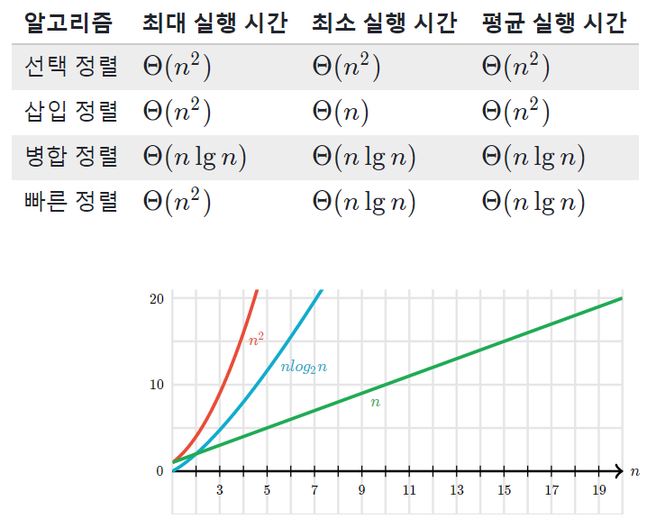

# Divide and Conquer(분할정복법)

분할정복법은 주어진 문제를 작은 사례로 나누고(Divide) 각각의 작은 문제들을 해결하여 정복(Conquer)하는 방법이다.

문제의 사례를 2개 이상의 더 작은 사례로 나눈다. 이 작은 사례는 주로 원래 문제에서 따온다. 나눈 작은 사례의 해답을 바로 얻을 수 있으면 해를 구하고 아니면 더 작은 사례로 나눈다.

분할정복법은 하향식(top-down) 접근 방법으로 최상위 사례의 해답은 아래로 내려가면서 작은 사례에 대한 해답을 구함으로써 구한다.

## 단계

1. Divide: 한 문제를 같은 크기를 갖는 몇 개의 subproblem들로 나눈다.
2. Conquer: 그리고 각각에 대해서 subproblem을 구한다.
3. Combine: 각 subproblem들에 대해 합치거나 더 가공하여 최종 답을 낸다.

## 설계 전략

1. 문제 사례를 하나 이상의 작은 사례로 분할(Divide)한다.
2. 작은 사례들을 각각 정복(Conquer)한다. 작은 사례가 충분히 작지 않은 이상 재귀를 사용한다.
3. 필요하다면, 작은 사례에 대한 해답을 통합(Combine)하여 원래 사례의 해답을 구한다.

## 장점

문제를 나눔으로써 어려운 문제를 해결할 수 있다는 엄청나게 중요한 장점이 있다. 그리고 이 방식이 그대로 사용되는 효율적인 알고리즘들도 여럿 있으며 문제를 나누어 해결한다는 특징상 병렬적으로 문제를 해결하는 데 큰 장점이 있다.

## 단점

함수를 재귀적으로 호출한다는 점에서 함수 호출로 인한 오버헤드가 발생하며, 스택에 다양한 데이터를 보관하고 있어야 하므로 스택 오버플로우가 발생하거나 과도한 메모리 사용을 하게되는 단점이 있다.

## 예시

분할정복법이 쓰이는 예는 이분검색, 합병정렬, 퀵정렬, 최대값 찾기, 임계갑의 결정, 쉬트라센 행렬곱셈 알고리즘 등이 있다.

